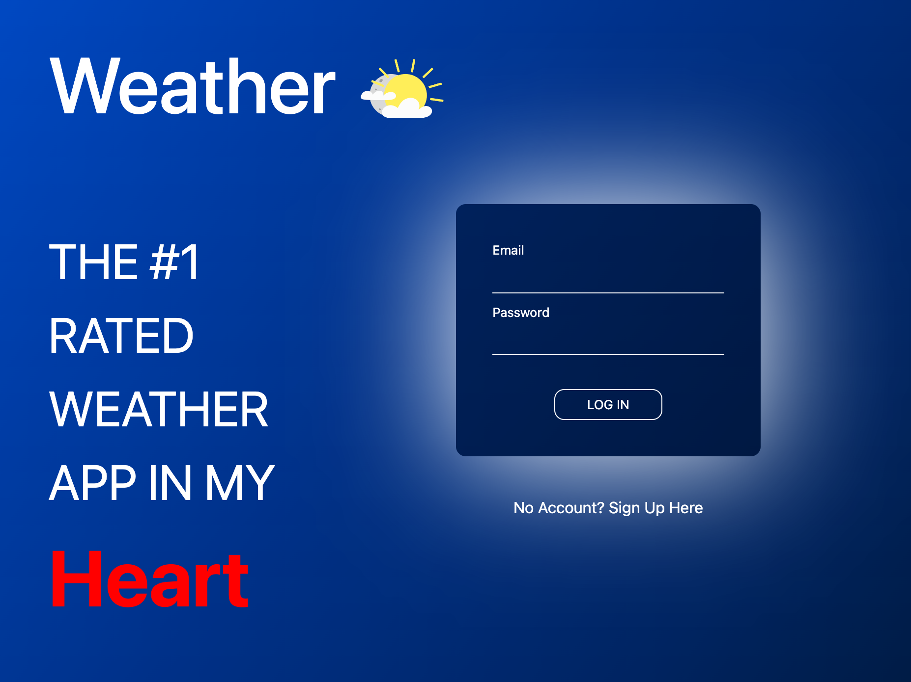
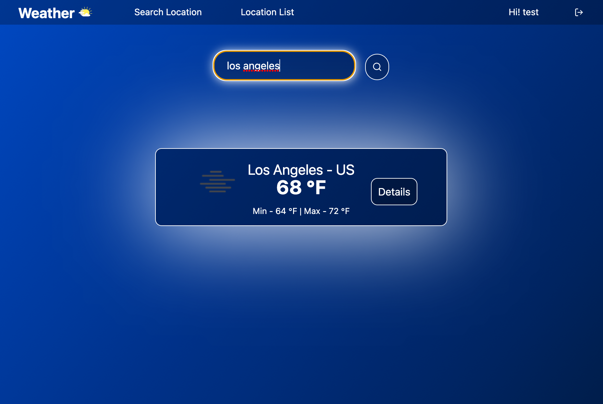
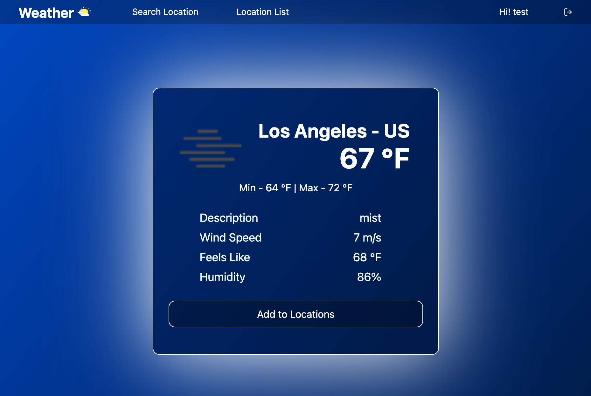
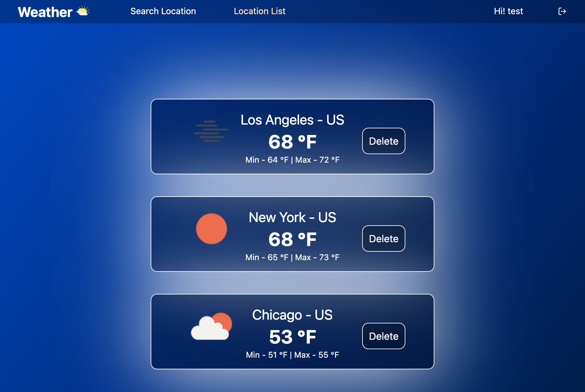

# Weather App
[Visit Weather App](https://project4-patrick-weather.herokuapp.com/)

---

## Project Description
- This is a MERN stack application that utilize the OpenWeather API to fetch the current weather information by city name. Users will be able to add the locations make a list of all saved locations!

---

## Project Screenshots

| Description | Screenshot |
|------------ | ------------|
| <h3 align="center">Log-in/Sign-up page</h3> |  |
| <h3 align="center">Search Weather Page</h3> |  |
| <h3 align="center">Weather Detail Page</h3> |  |
| <h3 align="center">Saved Locations Page</h3> |  |

---

## Technologies Used

 

 

 

---

## Original Wireframe and Planning Concept
- [Trello](https://trello.com/b/5N7MxFNf/ga-project-04)
- [ERD](https://lucid.app/lucidchart/cfd7231f-8647-4921-bc1f-efc4820970a0/edit?beaconFlowId=9578A03645C73C4B&invitationId=inv_d0e93a6a-5fda-407a-83ac-babcce29f9e9&page=0_0#)
- [Wireframe](https://whimsical.com/ga-project-04-FcV64aV6qnoaeg47kXdKLr)

---

## Future Add-Ons
- Add forecast weather data by implementing another API 
- New home page showing 5 cities weather
- Add current location's date and time to the weather card 

---

